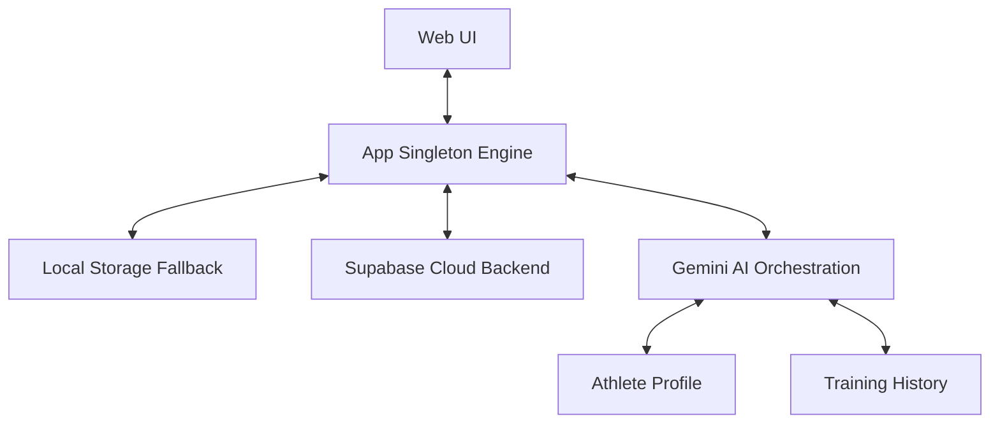

# ⚡ AthleteOS: Technical Documentation & User Guide

## 1. System Architecture

AthleteOS is built on a modular "App Engine" architecture using a singleton pattern. This ensures data integrity and centralized state management across the entire application lifecycle.

### 🏗️ Data Flow Diagram

## 2. Core Modules

### 🧠 Intelligence Suite (`ai.js`)
The `ai.js` module handles all interactions with the Google Gemini API. It uses sophisticated prompt engineering to context-aware responses.
- **Biomarker Analyst:** Scans historical data for patterns in HRV, sleep, and performance.
- **Workout Generator:** Creates logic-based training blocks (Strength, Hypertrophy, Aerobic).
- **Real-time Coach:** Provides RPE suggestions during active sets.

### 📊 Performance Analytics (`charts.js`)
Powered by Chart.js, this module manages the lifecycle of all visualizations.
- **Volume Radar:** Tracks weekly total volume (Sets × Reps × Weight).
- **Biomarker Trends:** Linear regression of health metrics over time.
- **PR Heatmaps:** Identifies peak performance windows.

### 🔌 Synchronization Engine (`app.js`)
Handles the dual-layer persistence strategy.
- **Layer 1 (Offline):** Instant JSON serialization to Browser LocalStorage.
- **Layer 2 (Cloud):** Asynchronous upserts to Supabase PostgreSQL schema.

## 3. UI/UX Design System

The application utilizes a **Modern Glassmorphism** design system defined in `style.css`.

### ✨ Key Design tokens:
- **Surface:** Semi-transparent HSL backgrounds with backdrop-filters.
- **Accent:** Electric Blue (`#3b82f6`) and Neon Green (`#10b981`).
- **Typography:** Inter/System-UI sans-serif stack for maximum readability.
- **Animations:** Custom CSS transitions for staggered item entry and view transitions.

## 4. Administrative Controls

For security, AthleteOS includes a "Lockdown Mode":
- **Config Lockdown:** Supabase URL and Keys are hardcoded in `GLOBAL_CONFIG` for production stability.
- **Admin Reveal:** Accessing the configuration panel requires the `?admin=admin` URL parameter (customizable).
- **API Key Masking:** All sensitive keys are masked in the UI with a 4-char reveal suffix for security.

## 5. Deployment Guide

### Vercel / Netlify Deployment:
1. Fork the repository.
2. Link the repository to your hosting provider.
3. (Optional) Set environment variables if you transition to a server-side build in the future.

### Supabase Schema Setup:
Ensure your `workouts`, `exercise_sessions`, `sets`, `biomarkers`, and `profiles` tables are properly initialized with RLS (Row Level Security) enabled.

---

**© 2026 AthleteOS Engineering Team**  
*Professional Handoff Document prepared by Antigravity AI.*
